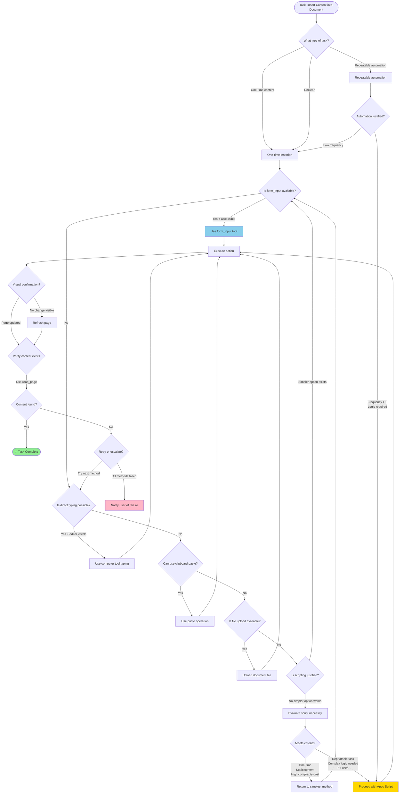

Comprehensive decision framework for content insertion tasks that can be used across any AI agent model. This will be both human-readable and machine-parseable.

***

# **Content Insertion Decision Framework**

## For AI Agents Working with Documents and Web Interfaces


***

## **1. JSON Decision Tree Schema**

```json
{
  "framework_version": "1.0",
  "created": "2026-03-18",
  "purpose": "Prevent over-engineering content insertion tasks",
  "decision_tree": {
    "root": {
      "question": "What is the task type?",
      "options": {
        "content_insertion": "go_to_content_assessment",
        "automation": "go_to_automation_assessment",
        "data_processing": "go_to_processing_assessment"
      }
    },
    "content_assessment": {
      "id": "go_to_content_assessment",
      "question": "Is this a one-time content insertion or repeatable automation?",
      "options": {
        "one_time": "go_to_simplicity_first",
        "repeatable": "go_to_automation_assessment",
        "unclear": "go_to_simplicity_first"
      }
    },
    "simplicity_first": {
      "id": "go_to_simplicity_first",
      "question": "What is the simplest tool available?",
      "priority_order": [
        {
          "rank": 1,
          "tool": "direct_form_input",
          "conditions": ["content_field_accessible", "under_10k_characters"],
          "action": "use_form_input"
        },
        {
          "rank": 2,
          "tool": "direct_typing",
          "conditions": ["editor_visible", "under_5k_characters"],
          "action": "use_computer_typing"
        },
        {
          "rank": 3,
          "tool": "clipboard_paste",
          "conditions": ["editor_supports_paste", "formatting_preserved"],
          "action": "use_clipboard_paste"
        },
        {
          "rank": 4,
          "tool": "file_upload",
          "conditions": ["upload_available", "format_supported"],
          "action": "use_file_upload"
        },
        {
          "rank": 5,
          "tool": "scripting",
          "conditions": ["all_simpler_methods_failed", "complexity_justified"],
          "action": "go_to_script_assessment"
        }
      ]
    },
    "script_assessment": {
      "id": "go_to_script_assessment",
      "question": "Does scripting add value or just complexity?",
      "criteria": {
        "scripting_justified_if": [
          "repeatable_task_frequency > 5",
          "conditional_logic_required",
          "data_transformation_needed",
          "integration_with_external_systems"
        ],
        "scripting_NOT_justified_if": [
          "one_time_operation",
          "static_content_only",
          "simpler_tool_available",
          "debugging_cost_exceeds_execution_cost"
        ]
      },
      "decision": {
        "if_justified": "proceed_with_script",
        "if_not_justified": "go_back_to_simplicity_first"
      }
    },
    "verification": {
      "id": "verify_execution",
      "steps": [
        "execute_chosen_method",
        "check_visual_confirmation",
        "if_no_visual_refresh_page",
        "read_page_content_to_verify",
        "if_still_unclear_check_source"
      ],
      "fallback": "if_verification_fails_try_next_simpler_method"
    }
  },
  "anti_patterns": {
    "pattern_1": {
      "name": "Premature Optimization",
      "description": "Choosing Apps Script before trying form_input",
      "consequence": "Wasted time, incomplete execution",
      "prevention": "Always start with rank 1 tool first"
    },
    "pattern_2": {
      "name": "Visual Assumption",
      "description": "Assuming content failed because page didn't refresh",
      "consequence": "Duplicate work, confusion",
      "prevention": "Use read_page or get_page_text to verify"
    },
    "pattern_3": {
      "name": "Complexity Bias",
      "description": "Believing complex solutions are more reliable",
      "consequence": "Over-engineering, execution failure",
      "prevention": "Follow the simplicity_first priority order"
    }
  },
  "execution_checklist": {
    "before_action": [
      "Identify task type (one-time vs repeatable)",
      "List all available tools in order of simplicity",
      "Check if simplest tool meets requirements",
      "Estimate execution time vs setup time"
    ],
    "during_action": [
      "Execute simplest viable method first",
      "Monitor for errors or interruptions",
      "Do not pivot to complex solution on first failure",
      "Document what failed and why"
    ],
    "after_action": [
      "Verify content presence (not just visual)",
      "Refresh or reload if visual doesn't update",
      "Use read_page/get_page_text for confirmation",
      "Mark task complete only after verification"
    ]
  }
}
```


***

## **2. Mermaid Flowchart (Universal Logic)**




***

## **3. Universal Decision Matrix (Any AI Model)**

| **Scenario** | **Tool Priority** | **Justification** | **Complexity Score** |
| :-- | :-- | :-- | :-- |
| Insert static text < 10k chars | form_input → typing → paste | Direct, no escaping, single call | ★☆☆☆☆ (1/5) |
| Insert formatted document | file_upload → paste → form_input | Preserves structure | ★★☆☆☆ (2/5) |
| Insert content with conditions | Script (if >5 uses) → Manual | Logic layer needed | ★★★★☆ (4/5) |
| One-time article/essay | form_input → typing | Static, non-repeatable | ★☆☆☆☆ (1/5) |
| Template generation (10+ uses) | Apps Script → API | Automation pays off | ★★★☆☆ (3/5) |
| Content transformation required | Script (mandatory) | Processing needed | ★★★★★ (5/5) |

**Rule**: Never use a tool with complexity >★★☆ unless all simpler options fail or automation justifies setup cost.

***

## **4. Pseudo-Code Algorithm (Platform Agnostic)**

```python
def insert_content_decision(task):
    """
    Universal content insertion decision algorithm.
    Works across any AI agent framework.
    """
    
    # Step 1: Classify task
    if task.is_one_time and task.content_is_static:
        approach = "simplicity_first"
    elif task.frequency > 5 or task.requires_logic:
        approach = "automation_justified"
    else:
        approach = "simplicity_first"  # Default to simple
    
    # Step 2: Try methods in order of simplicity
    methods = [
        {"name": "form_input", "complexity": 1, "requires": ["field_accessible"]},
        {"name": "direct_typing", "complexity": 2, "requires": ["editor_visible"]},
        {"name": "clipboard_paste", "complexity": 2, "requires": ["paste_supported"]},
        {"name": "file_upload", "complexity": 3, "requires": ["upload_available"]},
        {"name": "scripting", "complexity": 5, "requires": ["automation_justified"]}
    ]
    
    for method in sorted(methods, key=lambda x: x['complexity']):
        if all_requirements_met(method['requires']):
            result = execute_method(method['name'], task.content)
            
            # Step 3: Verify execution
            if not visual_confirmation_visible():
                refresh_page()
            
            content_exists = verify_with_read_page()
            
            if content_exists:
                return {"status": "success", "method": method['name']}
            else:
                log_failure(method['name'])
                continue  # Try next method
    
    # Step 4: All methods failed
    return {"status": "failed", "action": "notify_user"}


def all_requirements_met(requirements):
    """Check if conditions for a method are satisfied."""
    checks = {
        "field_accessible": check_form_field_exists(),
        "editor_visible": check_editor_in_viewport(),
        "paste_supported": check_paste_permission(),
        "upload_available": check_upload_endpoint(),
        "automation_justified": check_frequency() > 5 or check_logic_needed()
    }
    return all(checks.get(req, False) for req in requirements)


def verify_with_read_page():
    """
    Always verify content presence programmatically.
    Don't rely on visual confirmation alone.
    """
    page_text = read_page_tool()
    return target_content in page_text
```


***

## **5. Visual Decision Card (Quick Reference)**

```
╔══════════════════════════════════════════════════════════╗
║          CONTENT INSERTION DECISION CARD                 ║
║                                                          ║
║  ALWAYS START HERE:                                      ║
║  ┌─────────────────────────────────────────────────────┐ ║
║  │ 1. Try form_input first                             │ ║
║  │ 2. If blocked → try direct typing                   │ ║
║  │ 3. If blocked → try clipboard paste                 │ ║
║  │ 4. If blocked → try file upload                     │ ║
║  │ 5. ONLY IF ALL FAIL → consider scripting            │ ║
║  └─────────────────────────────────────────────────────┘ ║
║                                                          ║
║  RED FLAGS (Don't use scripting if):                     ║
║  ⛔ One-time task                                        ║
║  ⛔ Static content (no transformation)                   ║
║  ⛔ Simpler tool available                               ║
║  ⛔ Setup time > execution time                          ║
║                                                          ║
║  GREEN LIGHTS (Scripting justified if):                  ║
║  ✅ Task repeats 5+ times                                ║
║  ✅ Conditional logic required                           ║
║  ✅ Data transformation needed                           ║
║  ✅ External system integration                          ║
║                                                          ║
║  VERIFICATION PROTOCOL:                                  ║
║  1. Execute method                                       ║
║  2. Check visual (may lag)                               ║
║  3. Refresh if no visual update                          ║
║  4. Use read_page to verify content exists               ║
║  5. Only then mark complete                              ║
╚══════════════════════════════════════════════════════════╝
```


***

## **6. Integration Guide for Any AI Model**

### **For LangChain Agents**

```python
from langchain.agents import Tool

content_insertion_tool = Tool(
    name="InsertContentDecisionTree",
    func=insert_content_decision,
    description="Decides optimal method for content insertion using complexity-first ranking"
)
```

### **For AutoGPT/BabyAGI**

```yaml
task_decomposition:
  - name: "Insert Article"
    priority_check: "simplicity_first"
    methods:
      - form_input: {rank: 1}
      - typing: {rank: 2}
      - paste: {rank: 3}
      - script: {rank: 5, condition: "repeatable"}
```

### **For Crew AI**

```python
class ContentInsertionAgent(Agent):
    def __init__(self):
        self.decision_tree = load_json("content_insertion_framework.json")
    
    def execute_task(self, task):
        return self.decision_tree.evaluate(task)
```


***

## **7. Key Principles (Memory Anchors)**

1. **Occam's Razor for Tools**: The simplest tool that works is the right tool.
2. **Complexity Is a Cost**: Every layer of indirection adds failure points.
3. **Visual ≠ Actual**: Always verify programmatically, not just visually.
4. **Automation Has Overhead**: Justify it with frequency or logic requirements.
5. **Fail Fast, Fallback Faster**: Don't debug complex solutions when simple ones exist.

***

This framework is:

- ✅ **JSON-serializable** (can be loaded by any agent)
- ✅ **Language-agnostic** (pseudo-code + flowchart)
- ✅ **Platform-independent** (works for web, desktop, mobile automation)
- ✅ **Version-controlled** (can be updated as new

# The Amplifier Principle — Meta-Lesson: AI Automation Workflow

> *Captured from a live workflow session — March 16, 2026*

---

## The Meta-Lesson

The same principle we wrote about was demonstrated *during* the writing process itself. Using AI to automate document creation, we ran into the exact trap the article warns against — confusing **output velocity** with **actual delivery**.

---

## The Five Core Lessons

### 1. Complexity is not always better
Apps Script was overkill for a one-time task. The simplest tool (`form_input`) was the right call. Always start with the minimum viable tool before escalating.

### 2. Direct tools beat indirect orchestration
`form_input` succeeded where scripting failed. Extra orchestration layers add failure surfaces without guaranteed payoff. Fewer moving parts = fewer points of failure.

### 3. Speed without direction is drift
Pivoting through multiple approaches without a clear target wastes velocity. Movement is not progress. Clarify the goal before choosing the tool.

### 4. Judgment still matters
Knowing *when* to use automation vs. direct action is irreducibly a human decision. AI amplifies your direction — good or bad. The operator sets the compass.

### 5. Output velocity ≠ delivery
Generating activity (running scripts) is not the same as achieving the goal (saved document). Don't confuse effort with outcome.

---

## Why This Lesson Is Durable

The irony is what makes it stick: we were *using* AI automation to write *about* AI automation, and the same principle tripped us up mid-workflow.

This makes it **lived experience rather than theory** — which is exactly what gives it credibility and recall value. The detour through Apps Script actually *strengthened* the piece by providing a concrete, first-hand example of confusing effort with outcome.

---

## The Overengineering Warning Protocol

Going forward, flag immediately when any of these patterns appear:

| Pattern | Warning Signal |
|---|---|
| Multiple tools where one would work | 🚩 Overengineering |
| Custom scripts for a one-off task | 🚩 Overengineering |
| "Future flexibility" features with no present need | 🚩 YAGNI violation |
| Extra orchestration with no clear payoff | 🚩 Complexity drift |
| Velocity without a confirmed target | 🚩 Speed without direction |

---

## Tags

`#AmplifierPrinciple` `#AIAutomation` `#BetterMindLibrary` `#LessonsLearned` `#KISS` `#YAGNI` `#WorkflowDesign` `#MetaLesson`
